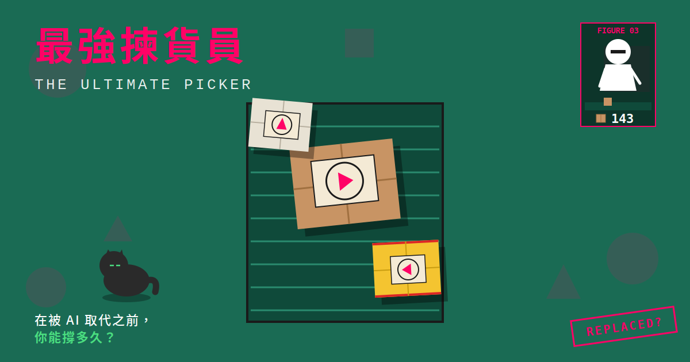

# 最強揀貨員 The Ultimate Picker



> 一款向 Figure 03 致敬（兼宣戰）的瘋狂揀貨小遊戲

A frantic warehouse picking game inspired by Figure 03 — outpace the AI before it replaces you.

[🎮 線上試玩 / Play Online](https://YOUR_USERNAME.github.io/ultimate-picker/)

---

## 🎯 遊戲簡介

你是一名倉庫揀貨員。輸送帶上的包裹瘋狂湧入，你必須沿著標籤上的箭頭方向滑動翻面。但畫面右上角，**Figure 03 正以比你更快的速度默默工作**——當牠的進度永遠領先，你的存在就失去意義。

撐多久才被資遣，由你決定。

## 🕹️ 操作

| 動作 | 說明 |
|---|---|
| 滑動標籤 | 沿箭頭方向滑動翻面（方向錯了不會翻） |
| 避開貓咪 🐱 / 老鼠 🐭 | 碰到扣 1 條命 |
| **絕對不能碰紅色易碎品** ⚠ | 翻了直接淘汰 |
| 速度要超過 Figure 03 | 超車時畫面綠光閃爍 + 加分音效 |

## 🎬 遊戲節奏

| 階段 | 時長 | 內容 |
|---|---|---|
| ROUND 1 | 0–30s | 一般出貨：暖身 |
| ROUND 2 | 30–60s | 混入易碎品：紅色標籤千萬別碰 |
| ROUND 3 | 60–90s | 黑色星期五：速度暴增、瘋狂堆疊 |
| BOSS | 90s+ | AI 親自下場：Figure 03 佔據半邊輸送帶 |

失敗時，Figure 03 會從畫面右上角衝下來把你拖走，並印發「資遣通知書」。

## 🛠️ 技術

- 純 HTML5 + Canvas，**單檔零依賴**
- Web Audio API 程式合成音效（不需音檔）
- 響應式直式畫面，**手機 + Web 雙平台**

整個遊戲就是一個 `index.html`，不需 build、不需 npm install。

## 🚀 本地運行

```bash
# 方法一：直接打開
open index.html

# 方法二：起一個本地伺服器（推薦，某些瀏覽器對 file:// 有限制）
python3 -m http.server 8000
# 然後開 http://localhost:8000
```

## 📦 部署到 GitHub Pages

1. 把這個倉庫 push 到 GitHub
2. 進 **Settings → Pages**
3. **Source** 選 `Deploy from a branch`
4. **Branch** 選 `main`（資料夾 `/ (root)`）
5. 等一兩分鐘，遊戲就會在 `https://<你的帳號>.github.io/<倉庫名>/` 上線

### ⚠️ 部署後一定要做：更新分享預覽圖網址

`index.html` 內的 Open Graph meta 預設為 `YOUR_USERNAME`，要改成你的 GitHub 帳號，分享連結才會顯示預覽圖：

```bash
# 用編輯器搜尋並取代
# 把 YOUR_USERNAME 全部換成你的 GitHub 使用者名稱
# 共會出現在 og:image / twitter:image / og:url 三處
```

或一行指令搞定（macOS/Linux）：

```bash
sed -i.bak 's|YOUR_USERNAME|你的帳號|g' index.html && rm index.html.bak
```

改完 push 上去，可以用以下工具測試預覽是否正常：
- [Facebook 偵錯工具](https://developers.facebook.com/tools/debug/)
- [Twitter Card Validator](https://cards-dev.twitter.com/validator)
- [OpenGraph.xyz](https://www.opengraph.xyz/)

## 📱 包成 Android APK（可選）

使用 [Capacitor](https://capacitorjs.com/) 把 Web 包成 Android app：

```bash
npm init -y
npm install @capacitor/core @capacitor/cli @capacitor/android
npx cap init "Ultimate Picker" com.example.ultimatepicker --web-dir=.
npx cap add android
npx cap sync
npx cap open android
# 在 Android Studio 內 Build → Generate Signed Bundle / APK
```

## 🎨 設計理念

- **視覺**：魷魚遊戲粉（#ff0266）× 墨綠（#1a6b54），高對比、扁平、幾何
- **諷刺**：揀貨員與 AI 的競爭，看似可愛實則殘酷的工作場景
- **節奏**：30 秒一階段，玩家始終處於壓力遞增的狀態

## 📝 License

MIT — 隨便用，但別商業上架的時候忘了 star 我一下 😉

## 🤝 Contributing

歡迎提 Issue 或 PR。一些可以擴充的方向：
- Boss 戰勝利條件（撐過 X 秒解鎖通關畫面）
- 連擊系統
- 每日挑戰（固定種子排行榜）
- 更多包裹類型 / 干擾物
- 國際化（英文介面）
